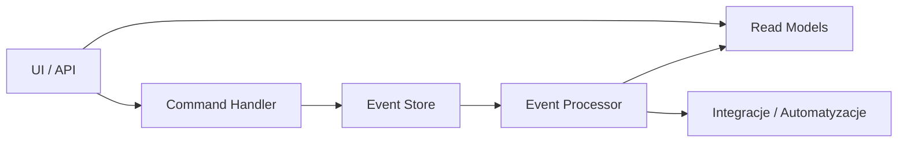

# **Dokumentacja systemu Founder.pl Modular Workflow + CQRS/Event Sourcing + NLP**

## 1. **Cel systemu**

System służy do:

1. Automatyzacji procesów biznesowych w formie workflow.
2. Integracji różnych modułów (Finanse, Reklama, Analiza, e-Doręczenia itp.).
3. Dynamicznego przetwarzania zdań w języku naturalnym (NLP) na kroki workflow.
4. Zapisu zdarzeń i akcji w **Event Store**, aktualizacji **Read Model** (CQRS).
5. Interaktywnej wizualizacji workflow w formie diagramów Mermaid.
6. Możliwości testowania i monitorowania akcji w czasie rzeczywistym.

---

## 2. **Główne funkcje systemu**

| Funkcja                        | Opis                                                                                                                      |
| ------------------------------ | ------------------------------------------------------------------------------------------------------------------------- |
| **Edytor YAML**                | Tworzenie i edycja workflow w YAML.                                                                                       |
| **Edytor NLP (zdania)**        | Przetwarza naturalny język na kroki workflow; batch NLP dla wielu zdań.                                                   |
| **Analiza dogłębna (NLP)**     | API `/api/analysis/deep` – analiza swobodnych fraz, sugeruje workflow i generuje skrypty (bash/node/python/browser).       |
| **Diagram Workflow (Mermaid)** | Wizualizacja kroków workflow. Interaktywny – kliknięcie akcji wyzwala zdarzenie.                                           |
| **CQRS + Event Sourcing**      | Komendy → zdarzenia → Read Model.                                                                                         |
| **Event Store / Read Model**   | Zapis zdarzeń i odczyt stanu.                                                                                              |
| **Log akcji**                  | Historia akcji (timestamp, status).                                                                                       |
| **Mapowanie modułów**          | Automatyczne przypisywanie modułów wg słów kluczowych.                                                                    |
| **SQLite DB (persistence)**    | `data/dsl.sqlite`; API: download/upload/validate; odporność na `SQLITE_NOTADB`.                                           |
| **Serializer (JSON/YAML)**     | API eksport/import z wersjonowaniem i migracjami.                                                                          |
| **Projekcje**                  | API projekcji (overview/timeline/workflows).                                                                               |
| **Sugestie**                   | API sugestii modułów i kroków.                                                                                             |
| **Historia (undo/redo)**       | Snapshot/restore EventStore i Read Model.                                                                                  |
| **Scenariusze i skrypty**      | UI + API do podziału `procesy.txt` na domeny, generowania YAML/diagramów/skryptów, uruchamiania skryptów.                 |
| **Docker/Compose**             | Serwer + e2e runner; wolumen `generated/`.                                                                                 |

---

## 3. **Przykładowe zdania testowe i mapowanie do workflow**

```html
Gdy wpłata klienta nastąpi, wystaw fakturę i uruchom kampanię retargetingową
Gdy nadejdzie nowe e-Doręczenie, powiadom zespół i zaktualizuj raporty księgowe
Gdy nowy klient zapisze się na newsletter, wyślij wiadomość powitalną i dodaj go do CRM
Gdy faktura zostanie opłacona, wygeneruj raport sprzedaży i zaktualizuj dashboard finansowy
```

**Jak system je obsługuje:**

1. Parsowanie zdania NLP → rozdzielenie **warunku** i **akcji**.
2. Generowanie unikalnego ID dla kroku workflow.
3. Automatyczne przypisanie modułów na podstawie słów kluczowych.
4. Dodanie kroków do workflow YAML i aktualizacja diagramu Mermaid.
5. Kliknięcie akcji lub automatyczne wywołanie → zapis zdarzenia w Event Store → aktualizacja Read Model → log akcji.

---

## 4. **CQRS / Event Sourcing**

**Architektura:**

1. **UI / API** – interfejs użytkownika lub zewnętrzne wywołania komend.
2. **Command Handler** – przyjmuje komendy (np. „wystaw fakturę”), waliduje i zapisuje zdarzenia.
3. **Event Store** – zapis wszystkich zdarzeń (immutable log).
4. **Event Processor** – przetwarza zdarzenia i aktualizuje Read Model lub wywołuje integracje.
5. **Read Models** – reprezentacja stanu workflow dla frontendu, tabel, dashboardów.
6. **Integracje / Automatyzacje** – wywołania zewnętrznych API, powiadomień, płatności.

**Diagram CQRS / Event Sourcing (Mermaid)**



---

## 5. **Testowanie systemu**

**1. Test NLP**

* Wprowadź zdanie:

    * „Gdy wpłata klienta nastąpi, wystaw fakturę i uruchom kampanię retargetingową.”
* System powinien:

    1. Wygenerować krok workflow: `wpłata_klienta_nastąpi`.
    2. Utworzyć akcje: `wystaw fakturę`, `uruchom kampanię retargetingową`.
    3. Zaktualizować diagram Mermaid.
    4. Kliknięcie akcji → wpis do Event Store → aktualizacja Read Model → log akcji.

**2. Test YAML**

* Edytuj YAML:

```yaml
steps:
  - id: newsletter
    name: Nowy klient newsletter
    module: Marketing
    actions:
      - id: welcome_email
        name: Wyślij wiadomość powitalną
        module: Marketing
      - id: add_to_crm
        name: Dodaj do CRM
        module: CRM
```

* Aktualizacja diagramu i test kliknięcia akcji działa analogicznie.

---

## 6. **Możliwe rozszerzenia systemu**

1. **Dynamiczne integracje z API**

    * Płatności, e-Doręczenia, systemy CRM, kampanie reklamowe.
    * Wywołania akcji asynchronicznych przy Event Processor.
2. **Obsługa warunków i reguł**

    * „Jeżeli faktura > 1000 zł, powiadom managera”.
    * Prosta logika warunkowa w NLP.
3. **Zaawansowane NLP**

    * Parsowanie wielu zdań naraz, koniunkcji („i”, „lub”), czasów przeszłych i przyszłych.
4. **Rozszerzenie Read Model**

    * Agregacja danych, wykresy, statystyki workflow.
5. **Interaktywna wizualizacja**

    * Drag&drop akcji w diagramie, dynamiczne przestawianie workflow.
6. **Zewnętrzne powiadomienia**

    * Webhooki, Slack, Teams, e-mail.

---

## 7. **Specyfikacja techniczna**

* **Frontend:** HTML, JS, Mermaid.js, js-yaml.js
* **Backend (opcjonalny):** Node.js / Python (do zapisów Event Store i integracji)
* **Przechowywanie danych:** Event Store w pamięci / DB, Read Model w pamięci lub bazie SQL/NoSQL
* **Rozszerzalność:** Nowe moduły, API, akcje mogą być dodawane w YAML/NLP bez zmian w kodzie głównym.

---

## 8. **Przykładowe użycie**

1. Edytor NLP:

   ```
   Gdy wpłata klienta nastąpi, wystaw fakturę i uruchom kampanię retargetingową.
   ```
2. System generuje workflow:

   ```
   Step: wpłata_klienta_nastąpi (Platnosci)
   Actions: wystaw fakturę (Finanse), uruchom kampanię retargetingową (Reklama)
   ```
3. Log akcji:

```
[2025-11-22T12:00:00Z] Akcja wykonana: wystaw fakturę
[2025-11-22T12:00:00Z] Akcja wykonana: uruchom kampanię retargetingową
```

4. Read Model:
   | Akcja | Status | Timestamp |
   |-------|--------|-----------|
   | wystaw fakturę | done | 2025-11-22T12:00:00Z |
   | uruchom kampanię retargetingową | done | 2025-11-22T12:00:00Z |

---

## 9. **Backend API – skrót**

- Workflow
  - `POST /api/workflow/nlp` – utwórz workflow ze zdania „Gdy …, …”.
  - `POST /api/workflow/nlp/batch` – przetwarzanie wielu zdań na raz (diagramy w odpowiedzi).
  - `POST /api/workflow/action` – wykonaj akcję (zapis do Event Store i Read Model).
  - `GET /api/workflow/workflows|events|readmodel|statistics` – odczyt.
  - `POST /api/workflow/validate` – walidacja struktury workflow.
  - `GET /api/workflow/duplicates` – wykryj duplikaty po `id`.

- Analiza
  - `POST /api/analysis/deep` – analiza swobodnych fraz (intencje, proponowany workflow, generacja skryptów).

- Serializer
  - `GET /api/serializer/export?format=json|yaml&dedupe=true|false`
  - `POST /api/serializer/import` – `{ format, data }`.

- Baza danych (SQLite)
  - `GET /api/db/download` – pobierz plik bazy.
  - `POST /api/db/upload` – wgraj bazę (base64).
  - `GET /api/db/validate` – sprawdzenie istnienia/ścieżki.

- Projekcje
  - `GET /api/projections/overview|timeline|workflows`

- Sugestie
  - `POST /api/suggestions/modules` – sugestie modułów na podstawie tekstu.
  - `POST /api/suggestions/sentence` – analiza zdania i rekomendacje.

- Scenariusze/Procesy
  - `GET /api/processes/split` – podziel `procesy.txt` na domeny (zapis do `generated/domains/*.txt`).
  - `POST /api/processes/generate?domain=all|<Domena>&baseUrl=<URL>` – generuj YAML/diagramy/skrypty.
  - `GET /api/processes/list` – lista artefaktów w `generated/`.
  - `GET /api/processes/archive` – archiwum `generated.tar.gz`.
  - `POST /api/exec/:lang/:action` – uruchom wygenerowany skrypt (`bash|node|python`).

- Mock API dla skryptów
  - `POST /api/mock/send-email`, `POST /api/mock/generate-invoice`, `GET /api/mock/invoice/:id`, `GET /api/mock/fetch-page`, `POST /api/mock/generate-report`.

---

## 10. **Scenariusze i skrypty – przepływ**

1. Podziel procesy: `GET /api/processes/split` lub przycisk w UI.
2. Wygeneruj artefakty: `POST /api/processes/generate?domain=all`.
3. Uruchamiaj skrypty: `POST /api/exec/bash|node|python/:action` lub z poziomu UI.
4. Pobierz całość: `GET /api/processes/archive`.

W UI dostępna sekcja „Scenariusze i Skrypty” (lista plików, uruchamianie, podgląd YAML/diagramu domeny).

---

## 11. **Docker / docker-compose**

```
docker compose up --build
```

- Serwis `dsl`: serwer HTTP (port 3000), healthcheck `/api/health`.
- Serwis `e2e`: po przejściu healthchecka uruchamia testy e2e procesów.
- Wolumen `./generated` – artefakty na hoście.

---

## 12. **Testy i status implementacji**

- Uruchamianie: `make test`.
  - Wykonywane są testy backend, frontend, integracyjne oraz e2e (w tym `e2e-processes` i `e2e-domains-diagrams`).
- Dodatkowo testy można uruchamiać selektywnie (`test-backend`, `test-frontend`, `test-integration`).

### Status (skrót)
- [x] Główne funkcje z sekcji 2 (YAML, NLP, diagramy, CQRS/ES, log, mapowanie modułów, interaktywność).
- [x] DB SQLite z walidacją i importem/eksportem przez UI/API (odporność na `SQLITE_NOTADB`).
- [x] Serializer JSON/YAML z migracjami + deduplikacja eksportu.
- [x] Projekcje, Sugestie, Historia snapshot/undo/redo.
- [x] Batch NLP i wizualizacja wielu diagramów.
- [x] Scenariusze i skrypty (podział domen, generacja YAML/diagramów/skryptów, uruchamianie skryptów, archiwum).
- [x] Analiza dogłębna (fallback dla swobodnych fraz) – `/api/analysis/deep`.
- [x] Docker/Compose + e2e runner.
- [ ] Zaawansowana interaktywna edycja workflow (drag&drop) – do rozważenia.
- [ ] Zewnętrzne powiadomienia produkcyjne (obecnie mock + webhooki podstawowe).

---

## 13. **Szybki start**

1. `make install`
2. `make server` lub `docker compose up --build`
3. UI: `http://localhost:3000`
4. Testy: `make test`
