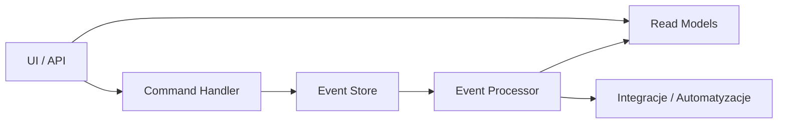

# **Dokumentacja systemu Founder.pl Modular Workflow + CQRS/Event Sourcing + NLP**

## 1. **Cel systemu**

System służy do:

1. Automatyzacji procesów biznesowych w formie workflow.
2. Integracji różnych modułów (Finanse, Reklama, Analiza, e-Doręczenia itp.).
3. Dynamicznego przetwarzania zdań w języku naturalnym (NLP) na kroki workflow.
4. Zapisu zdarzeń i akcji w **Event Store**, aktualizacji **Read Model** (CQRS).
5. Interaktywnej wizualizacji workflow w formie diagramów Mermaid.
6. Możliwości testowania i monitorowania akcji w czasie rzeczywistym.

---

## 2. **Główne funkcje systemu**

| Funkcja                        | Opis                                                                                                                      |
| ------------------------------ | ------------------------------------------------------------------------------------------------------------------------- |
| **Edytor YAML**                | Możliwość tworzenia i edycji workflow w formacie YAML. Workflow definiuje kroki, akcje i moduły.                          |
| **Edytor NLP (zdania)**        | System przetwarza naturalny język i zamienia zdania na kroki workflow.                                                    |
| **Diagram Workflow (Mermaid)** | Wizualizacja kroków workflow i zależności między nimi. Diagram jest interaktywny – kliknięcie akcji wyzwala zdarzenie.    |
| **CQRS + Event Sourcing**      | Oddzielenie logiki komend od stanu systemu. Komendy → zdarzenia → aktualizacja Read Model.                                |
| **Event Store**                | Zapis wszystkich zdarzeń (akcje wykonane w workflow, timestamp, status).                                                  |
| **Read Model**                 | Tabela pokazująca stan akcji, status i timestamp. Odzwierciedla aktualny stan workflow.                                   |
| **Log akcji**                  | Historia wykonanych akcji, przydatna do debugowania i monitorowania.                                                      |
| **Mapowanie modułów**          | Automatyczne przypisywanie kroków do modułów na podstawie słów kluczowych (np. płatności → Platnosci, faktura → Finanse). |
| **Interaktywność diagramu**    | Kliknięcie w węzeł wyzwala komendę, dodaje zdarzenie do Event Store i aktualizuje Read Model.                             |

---

## 3. **Przykładowe zdania testowe i mapowanie do workflow**

```html
Gdy wpłata klienta nastąpi, wystaw fakturę i uruchom kampanię retargetingową
Gdy nadejdzie nowe e-Doręczenie, powiadom zespół i zaktualizuj raporty księgowe
Gdy nowy klient zapisze się na newsletter, wyślij wiadomość powitalną i dodaj go do CRM
Gdy faktura zostanie opłacona, wygeneruj raport sprzedaży i zaktualizuj dashboard finansowy
```

**Jak system je obsługuje:**

1. Parsowanie zdania NLP → rozdzielenie **warunku** i **akcji**.
2. Generowanie unikalnego ID dla kroku workflow.
3. Automatyczne przypisanie modułów na podstawie słów kluczowych.
4. Dodanie kroków do workflow YAML i aktualizacja diagramu Mermaid.
5. Kliknięcie akcji lub automatyczne wywołanie → zapis zdarzenia w Event Store → aktualizacja Read Model → log akcji.

---

## 4. **CQRS / Event Sourcing**

**Architektura:**

1. **UI / API** – interfejs użytkownika lub zewnętrzne wywołania komend.
2. **Command Handler** – przyjmuje komendy (np. „wystaw fakturę”), waliduje i zapisuje zdarzenia.
3. **Event Store** – zapis wszystkich zdarzeń (immutable log).
4. **Event Processor** – przetwarza zdarzenia i aktualizuje Read Model lub wywołuje integracje.
5. **Read Models** – reprezentacja stanu workflow dla frontendu, tabel, dashboardów.
6. **Integracje / Automatyzacje** – wywołania zewnętrznych API, powiadomień, płatności.

**Diagram CQRS / Event Sourcing (Mermaid)**



---

## 5. **Testowanie systemu**

**1. Test NLP**

* Wprowadź zdanie:

    * „Gdy wpłata klienta nastąpi, wystaw fakturę i uruchom kampanię retargetingową.”
* System powinien:

    1. Wygenerować krok workflow: `wpłata_klienta_nastąpi`.
    2. Utworzyć akcje: `wystaw fakturę`, `uruchom kampanię retargetingową`.
    3. Zaktualizować diagram Mermaid.
    4. Kliknięcie akcji → wpis do Event Store → aktualizacja Read Model → log akcji.

**2. Test YAML**

* Edytuj YAML:

```yaml
steps:
  - id: newsletter
    name: Nowy klient newsletter
    module: Marketing
    actions:
      - id: welcome_email
        name: Wyślij wiadomość powitalną
        module: Marketing
      - id: add_to_crm
        name: Dodaj do CRM
        module: CRM
```

* Aktualizacja diagramu i test kliknięcia akcji działa analogicznie.

---

## 6. **Możliwe rozszerzenia systemu**

1. **Dynamiczne integracje z API**

    * Płatności, e-Doręczenia, systemy CRM, kampanie reklamowe.
    * Wywołania akcji asynchronicznych przy Event Processor.
2. **Obsługa warunków i reguł**

    * „Jeżeli faktura > 1000 zł, powiadom managera”.
    * Prosta logika warunkowa w NLP.
3. **Zaawansowane NLP**

    * Parsowanie wielu zdań naraz, koniunkcji („i”, „lub”), czasów przeszłych i przyszłych.
4. **Rozszerzenie Read Model**

    * Agregacja danych, wykresy, statystyki workflow.
5. **Interaktywna wizualizacja**

    * Drag&drop akcji w diagramie, dynamiczne przestawianie workflow.
6. **Zewnętrzne powiadomienia**

    * Webhooki, Slack, Teams, e-mail.

---

## 7. **Specyfikacja techniczna**

* **Frontend:** HTML, JS, Mermaid.js, js-yaml.js
* **Backend (opcjonalny):** Node.js / Python (do zapisów Event Store i integracji)
* **Przechowywanie danych:** Event Store w pamięci / DB, Read Model w pamięci lub bazie SQL/NoSQL
* **Rozszerzalność:** Nowe moduły, API, akcje mogą być dodawane w YAML/NLP bez zmian w kodzie głównym.

---

## 8. **Przykładowe użycie**

1. Edytor NLP:

   ```
   Gdy wpłata klienta nastąpi, wystaw fakturę i uruchom kampanię retargetingową.
   ```
2. System generuje workflow:

   ```
   Step: wpłata_klienta_nastąpi (Platnosci)
   Actions: wystaw fakturę (Finanse), uruchom kampanię retargetingową (Reklama)
   ```
3. Log akcji:

```
[2025-11-22T12:00:00Z] Akcja wykonana: wystaw fakturę
[2025-11-22T12:00:00Z] Akcja wykonana: uruchom kampanię retargetingową
```

4. Read Model:
   | Akcja | Status | Timestamp |
   |-------|--------|-----------|
   | wystaw fakturę | done | 2025-11-22T12:00:00Z |
   | uruchom kampanię retargetingową | done | 2025-11-22T12:00:00Z |

